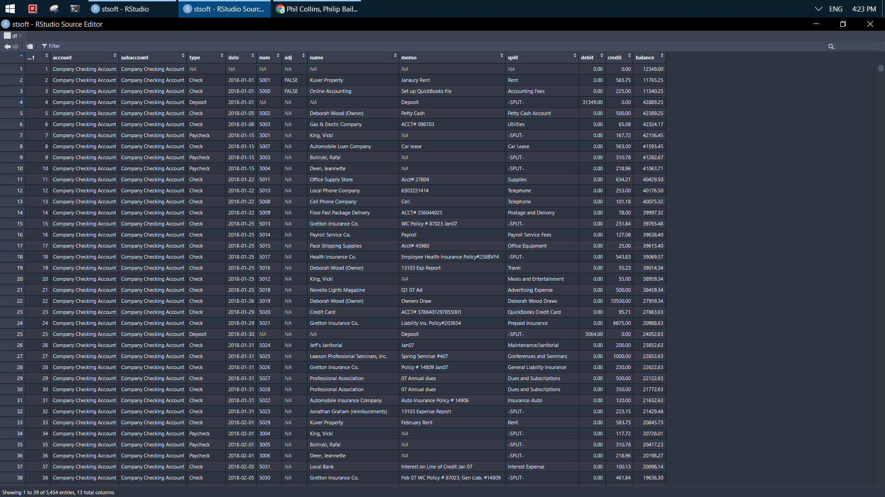
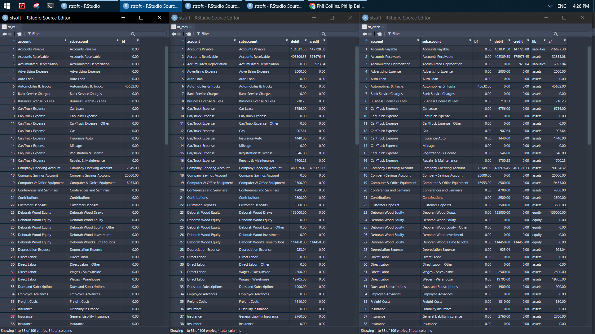
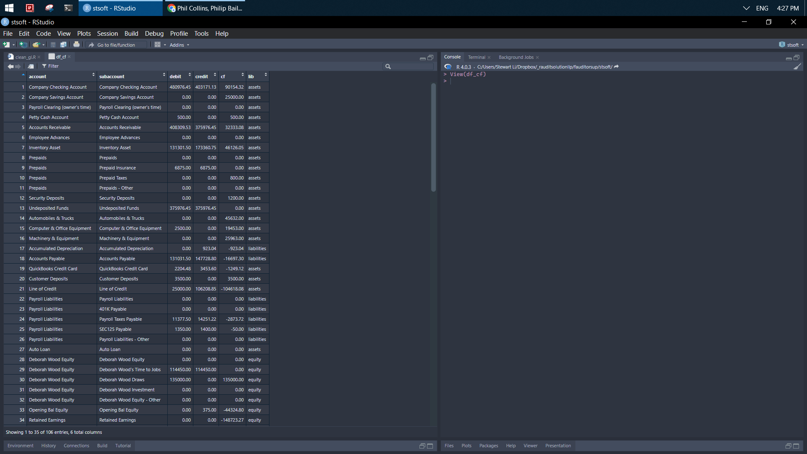
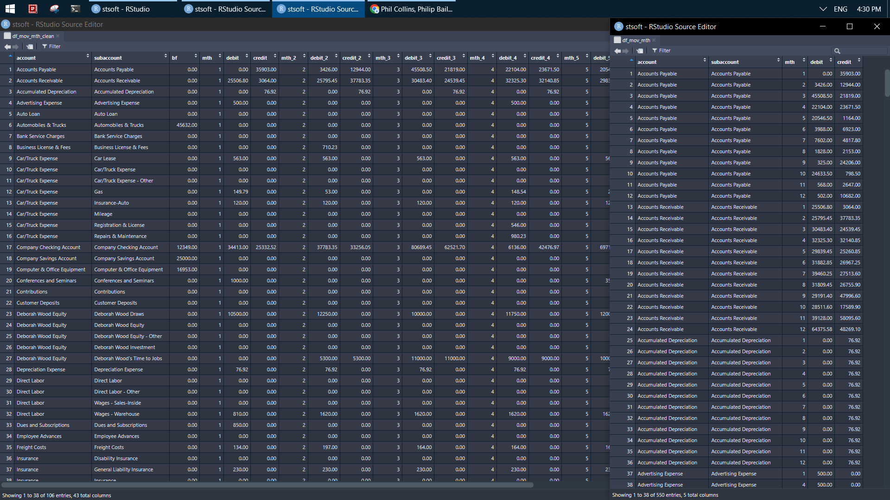
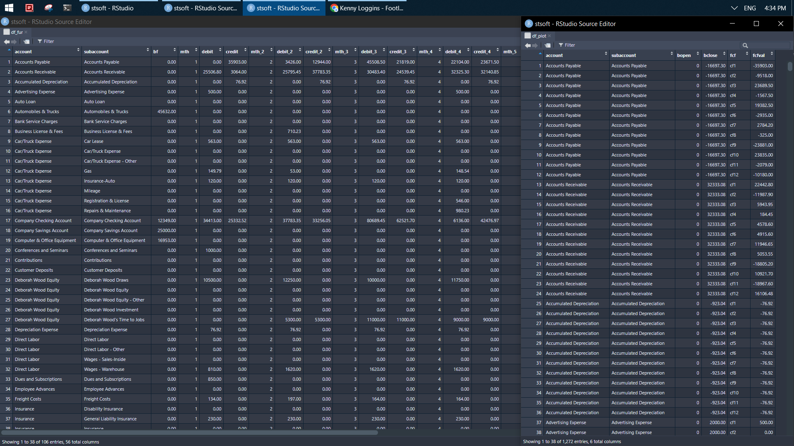
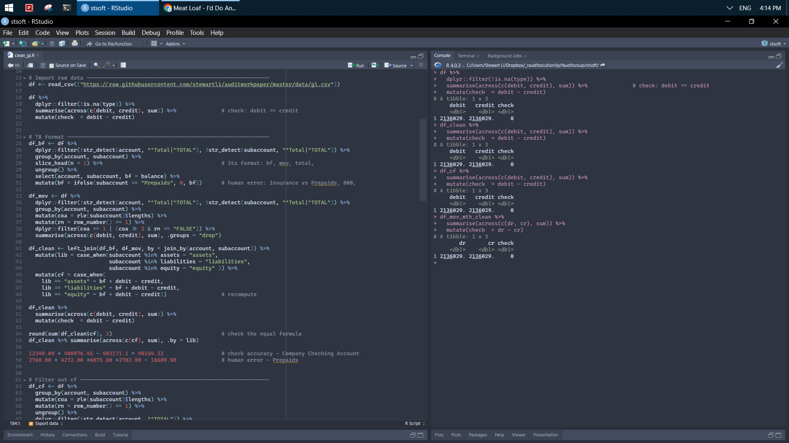
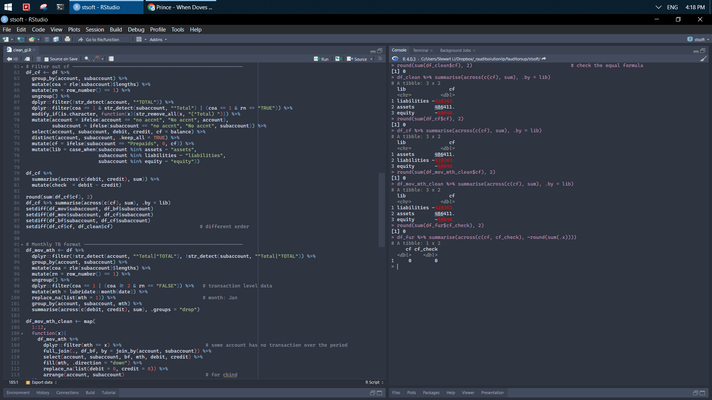
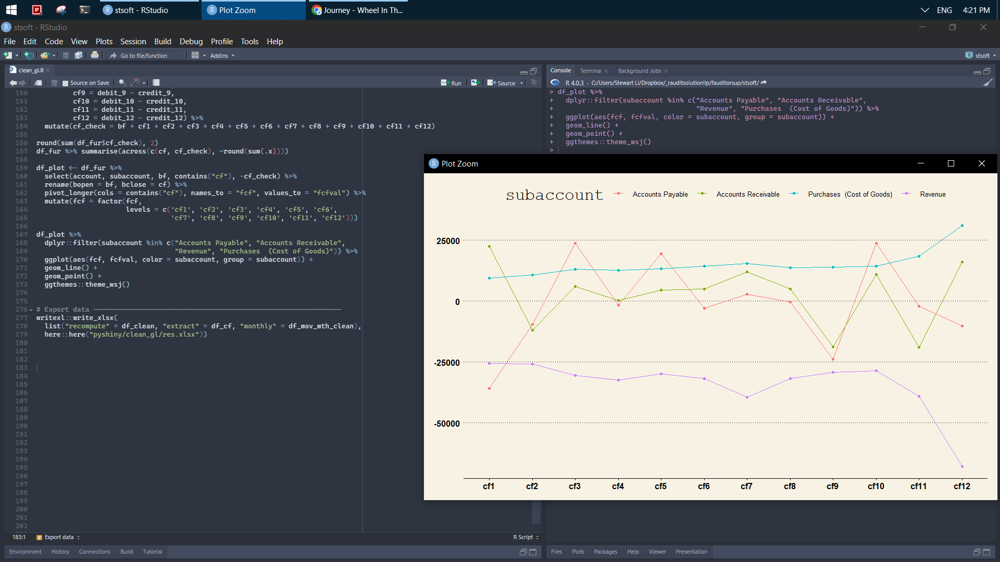
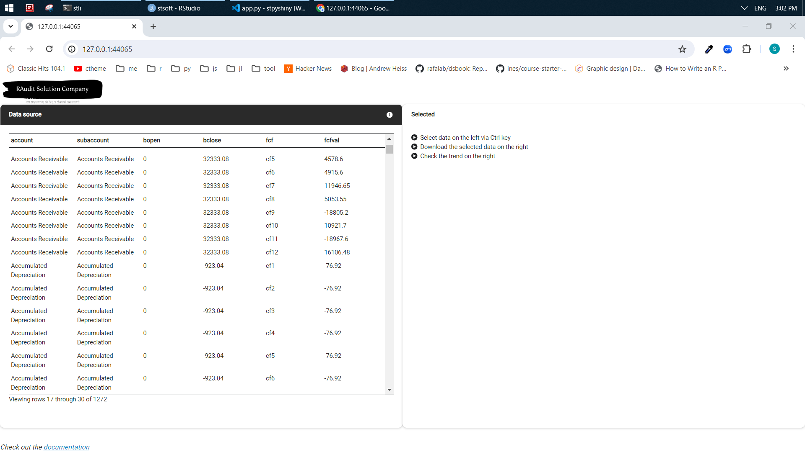
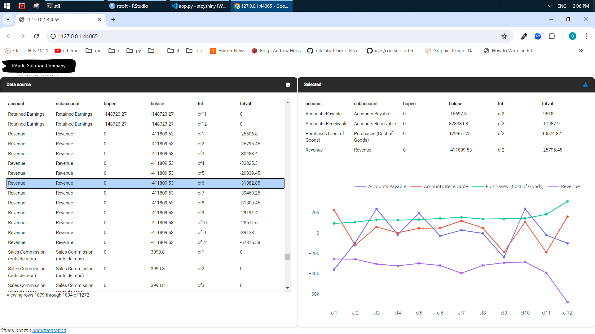

General ledger (GL) is only data source generated by an accounting system for Financial Statement (FS). The ability of examining GL data is fundamental for financial auditors and accountants. Proper data tools such as R, Python, and SQL should be used because Excel is very limited under the circumstances. I showcase the power of programming languages with the following example.    

 

**1** Clean and reshape data to ensure it is in a good state for the further analysis.    

 

**2** Perform cross-checks to ensure total debit always equals total credit and the sum of balance equals nil.   

 

**3** Create and deploy the [dashboard](https://stewartli.github.io/gl2tb/). 

